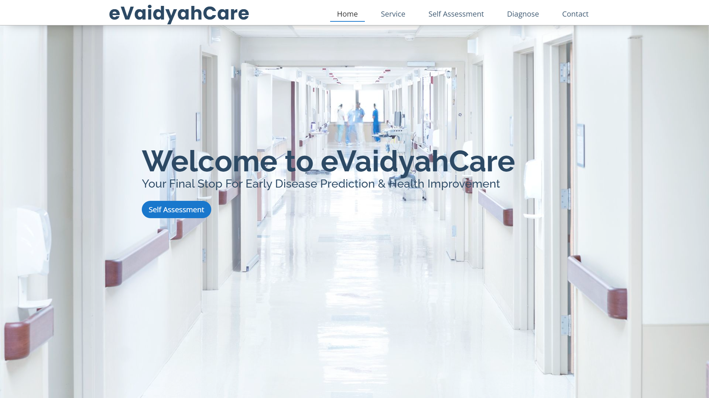
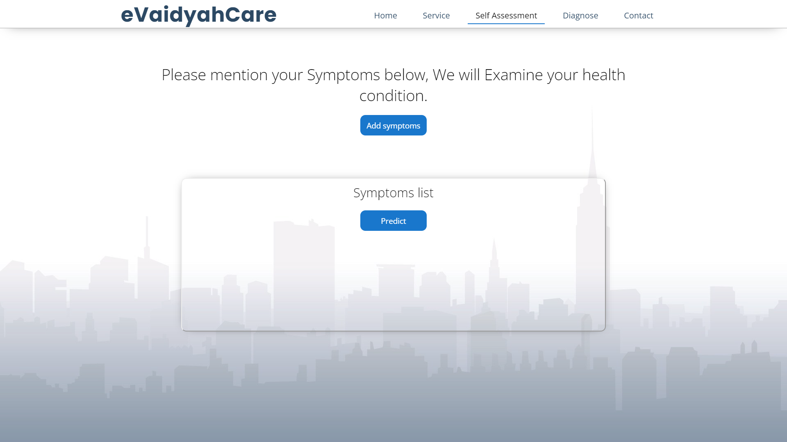
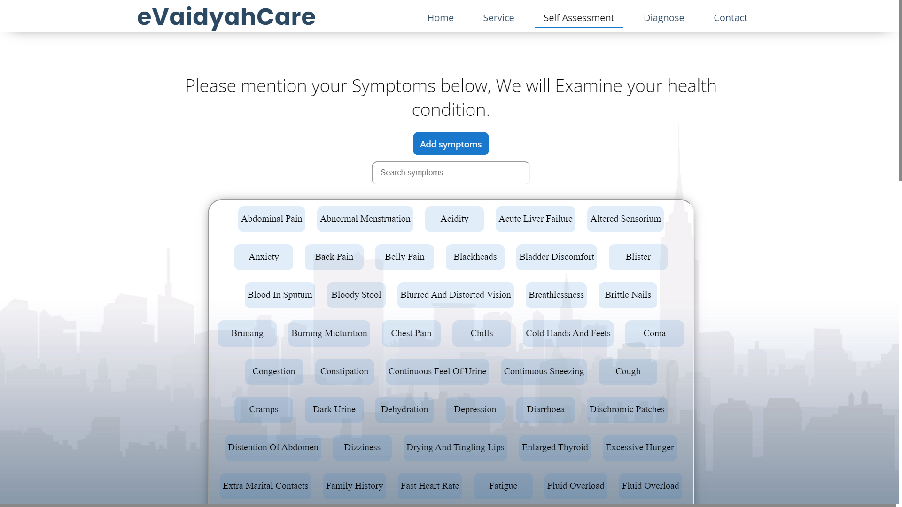
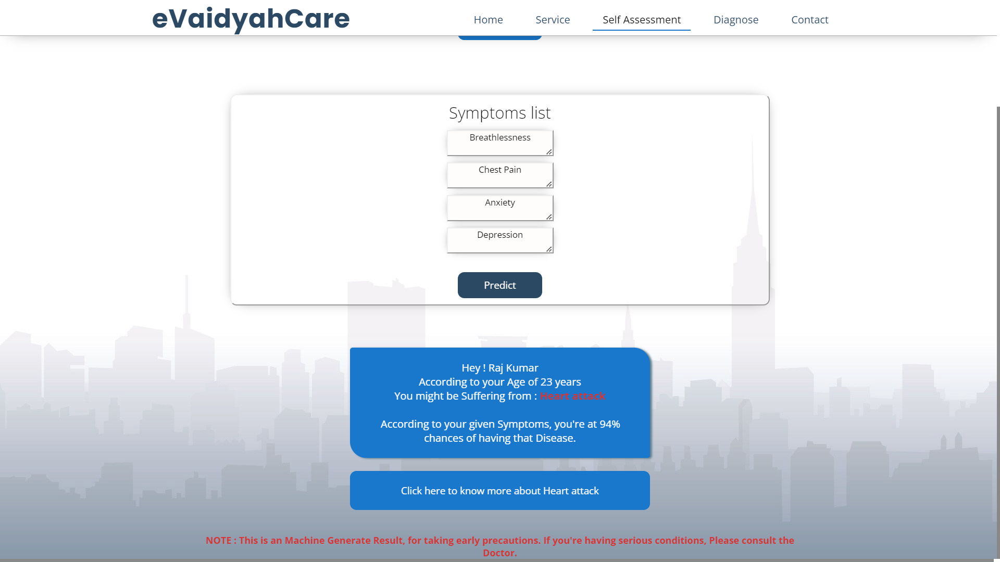
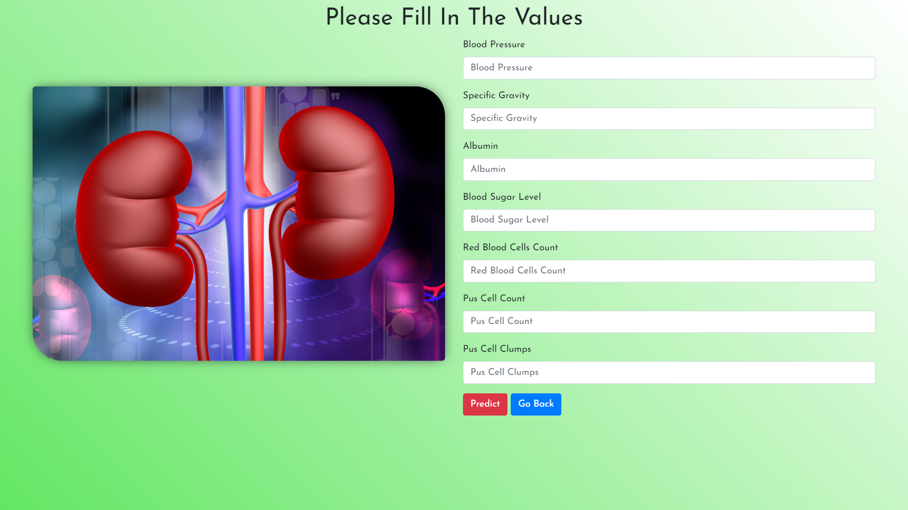

<p  align="right">

# <p align="center"> Welcome🙏🏻 </p>


# <p align="center">Project Demonstration</p>

## Home



## Self Assessment






## Diagnose




## Liver Disorder Checkup


## Risk Report


## Safe Report


<hr>

# <p align="center">Project Installations in Local System</p>

## Tools & Technology Required

- Python
- Django
- HTML
- CSS
- Javascript
- Machine Learning

<p align="center">


  
 
 


</p>

## Run Locally

- Download the Project and Unzip it
- Open Commant Prompt
> You must have Python3 installed in your system


Go to the project directory
```bash
    cd MEDXPERT_MAJORPROJECT
```

Create Virtual Envoirnment of Python
```bash
    pip install virtualenvwrapper-win
```

Make Virtual Envoirnment as I named it `venv`
```
    mkvirtualenv venv
```
Open Virtual Envoirnment as

```bash
    workon venv
```

Install Dependencies

```bash
    pip install -r requirenments.txt
```

Start the Server
```bash
    python manage.py runserver
```

>   Development Server started at `localhost:8000`